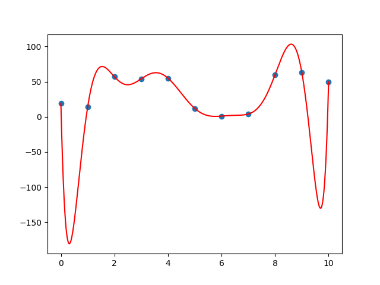

# Lagrange Interpolation

Given N coordinates points, generates a polynomial of N-1 degree which contains all points.

**Unstable with large number of points.**

**(Starts getting ugly at 10+ points)**

**(Falls apart at ~20 points)**

 

## Usage
### As an import
```
import lagrange_interpolation

xs = [1, 2, 3]
ys = [4, 5, 6]

polynomial = lagrange_interpolation.interpolate(xs, ys)
lagrange_interpolation.plot(xs, ys)
```

## Technical
1. For each coordinate point *k*, generate a Lagrange polynomial which equals 1 at the x-coordinate and 0 at all other x-coordinates.

L<sub>k</sub>(*x*<sub>k</sub>) = *c* (*x*-*x*<sub>1</sub>)...(*x*-*x*<sub>k-1</sub>)(*x*-*x*<sub>k+1</sub>)...(*x*-*x*<sub>n</sub>)

Derive *c* by evaluating the expression with *x*<sub>k</sub> and taking the reciprocal.

2. The Lagrange polynomial needs to actually equal the value of *y*<sub>k</sub>, so multiply *c* by *y*<sub>k</sub> to get the correct *c* value.

3. Finally, sum all Lagrange polynomials to get the final polynomial which contains all points.

P(*x*) = L<sub>1</sub>(*x*<sub>1</sub>) + L<sub>2</sub>(*x*<sub>2</sub>) + ... + L<sub>n</sub>(*x*<sub>n</sub>)
